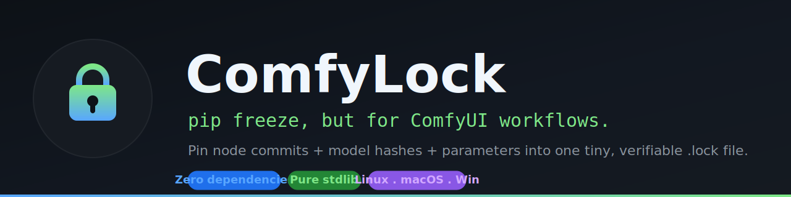
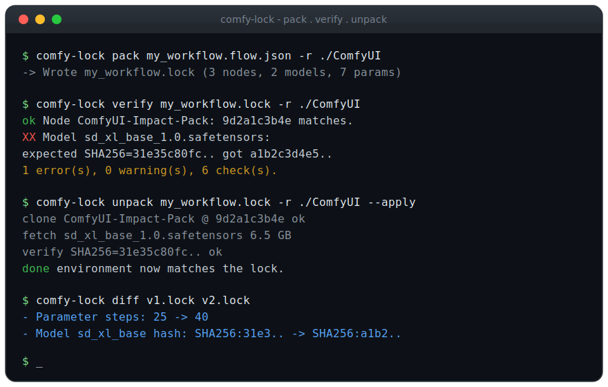
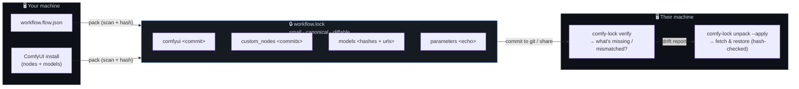
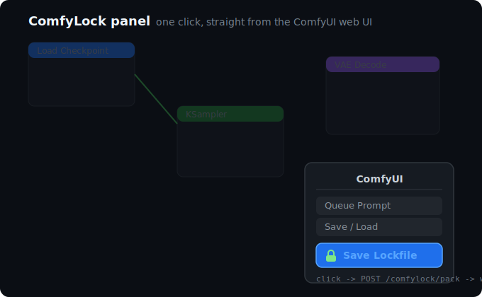
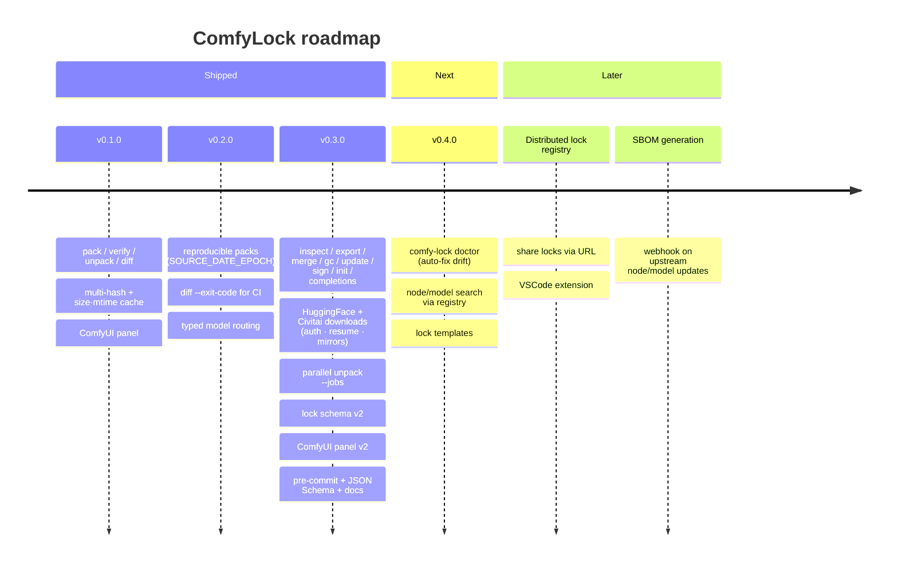

<div align="center">



# 🔒 ComfyLock

### `pip freeze`, but for ComfyUI workflows.

**Pin your custom-node commits, model file hashes, and key parameters into one small,
portable, verifiable `.lock` file — so the workflow that works on your machine works on theirs.**

[](https://github.com/theot44240-tech/comfylock/actions/workflows/ci.yml)
[](https://pypi.org/project/comfylock/)
[](https://www.python.org/)
[](#-why-its-different)
[](LICENSE)
[](#-quality--proof-points)
[](CHANGELOG.md)

[](https://github.com/theot44240-tech/comfylock/stargazers)
[](https://github.com/theot44240-tech/comfylock/network/members)
[](https://github.com/theot44240-tech/comfylock/graphs/contributors)
[](https://github.com/theot44240-tech/comfylock/issues)
[](https://github.com/theot44240-tech/comfylock/commits/main)

[Quick start](#-quick-start-60-seconds) ·
[Why it's different](#-why-its-different) ·
[The lockfile](#-the-lockfile) ·
[ComfyUI panel](#-comfyui-panel) ·
[FAQ](#-faq)

</div>

---

## ⚡ TL;DR

- **What:** a tiny CLI (and ComfyUI button) that pins a workflow's node commits, model hashes, and key parameters into one portable `.lock` file.
- **Why:** shared ComfyUI workflows silently break on other machines — different node versions, swapped weights, drifted parameters. ComfyLock turns "works on my machine" into "works on theirs."
- **How fast:** `pip install` → `pack` → commit the `.lock` → on the other side `verify` tells you exactly what's missing or mismatched, and `unpack` fetches it back (hash-checked).
- **The catch:** there isn't one — the core is **pure Python standard library, zero runtime dependencies.**

<div align="center">



<sub>The whole loop: <code>pack</code> → share the <code>.lock</code> → <code>verify</code> → <code>unpack</code>.</sub>

</div>

> [!TIP]
> Want a real animated demo? Record the loop with [`asciinema`](https://asciinema.org) and convert
> with [`agg`](https://github.com/asciinema/agg) (`agg demo.cast assets/demo.gif`), or capture your
> terminal with `ffmpeg -ss` and trim to <10s. Drop it at `assets/demo.gif` and reference it here.

---

## 🧨 The problem

Shared ComfyUI workflows break on someone else's machine all the time. The *same* `.flow.json`
graph silently produces different results — or refuses to load — because of:

| Layer | What goes wrong |
| --- | --- |
| 🧩 **Custom nodes** | The graph references node types you don't have installed. |
| 🔁 **Node versions** | A node updated and quietly changed its behavior. |
| 🎛️ **Model files** | Same filename, different weights — a different hash entirely. |
| 🎚️ **Parameters** | Sampler, scheduler, seed, or steps drifted without anyone noticing. |

ComfyUI ships and updates *fast*, which makes all four worse. The result is hours lost chasing
"why does this look different than the screenshot?"

**ComfyLock fixes this by pinning all of it at once** — into a single lightweight, local, diffable artifact.

---

## ⚡ Quick start (60 seconds)

> **Heads up:** ComfyLock isn't on PyPI yet (a release is on the [roadmap](#-roadmap)).
> Install it straight from GitHub today:

```bash
pip install "git+https://github.com/theot44240-tech/comfylock.git"
```

**1. Pack** — turn a workflow + your ComfyUI install into a lockfile:

```bash
comfy-lock pack my_workflow.flow.json -r /path/to/ComfyUI --hash SHA256 --hash AutoV2
# -> Wrote my_workflow.lock
```

**2. Verify** — on any machine, check reality against the lock:

```bash
comfy-lock verify my_workflow.lock -r /path/to/ComfyUI
# ok Node ComfyUI-Impact-Pack: 9d2a1c3b4e matches.
# XX Model 'sd_xl_base_1.0.safetensors': expected SHA256=31e35c80fc.. but got a1b2c3d4e5.. (re-download?).
# 1 error(s), 0 warning(s), 6 check(s).
```

**3. Unpack** — restore the missing pieces (preview first, then apply):

```bash
comfy-lock unpack my_workflow.lock -r /path/to/ComfyUI            # dry run, shows the plan
comfy-lock unpack my_workflow.lock -r /path/to/ComfyUI --apply    # clone nodes + download models
```

That's the whole loop: **pack → share the `.lock` → verify → unpack.**

---

## ✨ Why it's different

ComfyLock is deliberately small and sharp. The entire core is **pure Python standard library —
zero runtime dependencies.** YAML and BLAKE3 are *optional* extras, never requirements.

<table>
<tr><td>

🧷 **Three-layer pinning**
ComfyUI core commit · custom-node commits (git repos *and* local `.py` file nodes) · model file hashes.

</td><td>

🔢 **Multiple hash types**
SHA256 (default), AutoV2 / AutoV1 (Civitai / A1111 compatible), CRC32, BLAKE2B, and optional BLAKE3.

</td></tr>
<tr><td>

🎛️ **Parameter echo**
Seed, steps, cfg, sampler, scheduler, denoise and more — recorded for human-readable diffs.

</td><td>

🔍 **Semantic diff**
See exactly what changed between two versions of a workflow — nodes, models, and parameters.

</td></tr>
<tr><td>

✅ **Verify & restore**
Check an environment against a lock, or fetch the missing pieces to recreate it — hashes checked on the way in.

</td><td>

⚙️ **Reproducible by design**
`pack` honors `SOURCE_DATE_EPOCH`; two packs of the same environment are byte-identical. Great for CI and diffing.

</td></tr>
<tr><td>

🚀 **Big-model friendly**
A size + mtime cache avoids rehashing multi-gigabyte models on every run.

</td><td>

🖱️ **ComfyUI panel**
A **🔒 Save Lockfile** button right inside the ComfyUI web UI.

</td></tr>
</table>

### How it compares

Existing tools each cover *part* of the gap. ComfyLock's niche is a single shareable, diffable
artifact that pins all three layers — and stays dependency-free.

| | Pins node commits | Pins model hashes | Shareable & diffable artifact | Lightweight / zero-dep |
| --- | :---: | :---: | :---: | :---: |
| **ComfyLock** | ✅ | ✅ | ✅ | ✅ |
| ComfyUI-Manager *(snapshot)* | ✅ | ❌ | ⚠️ snapshot, not model-aware | ➖ |
| Comfy-Pack | ✅ | ✅ | ❌ bundles whole env (heavy, archived) | ❌ |
| comfy-cli `comfy-lock.yaml` | ⚠️ install-time config | ❌ | ❌ not a portable artifact | ➖ |

<sub>Comparison reflects each tool's documented scope, not a head-to-head benchmark.</sub>

---

## 🛠️ CLI reference

```text
comfy-lock pack    <workflow.json>  [-o out.lock] [-r ROOT] [--hash TYPE]... [--lock-version 1|2] [--strict] [--provenance]
comfy-lock verify  <workflow.lock>  [-r ROOT] [--no-hash] [--strict] [--check-sig]
comfy-lock unpack  <workflow.lock>   -r ROOT  [--apply] [--no-models] [--jobs N]
comfy-lock diff    <old.lock> <new.lock> [--exit-code]
comfy-lock inspect <workflow.lock>  [--json] [--no-color]
comfy-lock export  <workflow.lock>  --format markdown|manager-snapshot|dockerfile|json-schema [-o out]
comfy-lock manager-import <snapshot.json> [-o out.lock] [-r ROOT]
comfy-lock merge   <a.lock> <b.lock>... -o combined.lock [--strategy first|strict]
comfy-lock gc       -r ROOT  [--locks-dir .] [--dry-run] [--delete]
comfy-lock update  <workflow.lock>   -r ROOT  [--nodes] [--models] [--params] [--dry-run] [-o out]
comfy-lock sign    <workflow.lock>  [--key KEY] [--sigstore]
comfy-lock init
comfy-lock completions --shell bash|zsh|fish|powershell
comfy-lock selftest
```

| Command | What it does |
| --- | --- |
| `pack` | Read a workflow, scan the ComfyUI install, write a `.lock` with node commits, model hashes, and parameters. `--strict` fails on a missing model. |
| `verify` | Compare the current environment to a lock. **Exit code is non-zero on any mismatch** — drop it straight into CI. `--check-sig` requires a valid signature first. |
| `unpack` | Dry-run by default; with `--apply`, clone/checkout custom nodes and download missing models (`--jobs N` in parallel), verifying hashes after each download. |
| `diff` | Semantic comparison of two locks. `--exit-code` returns 1 when they differ, like `git diff --exit-code`. |
| `inspect` | A rich, human-readable summary of a lock (`--json` to re-emit for `jq`). |
| `export` | Render a lock as Markdown, a ComfyUI-Manager snapshot, a Dockerfile, or its JSON Schema. |
| `manager-import` | Build a lock from a ComfyUI-Manager `snapshot.json`. |
| `merge` | Combine several locks into one environment lock (`first`/`strict` conflict handling). |
| `gc` | Find (and optionally delete) model files no lock references. |
| `update` | Refresh pinned commits / hashes / params in place, without a full re-pack. |
| `sign` | Write a detached GPG signature `<lock>.asc` for trusted distribution. |
| `init` | Interactive first-run wizard. |
| `completions` | Emit a shell completion script. |
| `selftest` | Run the built-in, offline self-test suite. |

See the [`docs/`](docs/getting-started.md) directory for per-feature guides:
[CI/CD](docs/ci-cd.md) · [Docker](docs/docker.md) ·
[shell completions](docs/shell-completions.md) · [signed locks](docs/signed-locks.md) ·
[ComfyUI-Manager interop](docs/manager-interop.md) · [lockfile schema](docs/lockfile-schema.md) ·
[pre-commit](docs/pre-commit.md) · [security](docs/security.md).

<details>
<summary><b>More usage examples</b></summary>

See exactly what changed between two versions of a workflow:

```bash
comfy-lock diff v1.lock v2.lock
# - ComfyUI: 0b3e9f1a2c -> 7c4d5e6f70
# - Node https://github.com/ltdrdata/ComfyUI-Impact-Pack.git: 9d2a1c3b4e -> a1b2c3d4e5
# - Model sd_xl_base_1.0.safetensors hash: SHA256:31e35c80fc -> SHA256:a1b2c3d4e5
# - Parameter steps: 25 -> 40
```

Gate a CI job on a workflow staying reproducible:

```bash
comfy-lock pack my_workflow.flow.json -r ./ComfyUI -o /tmp/fresh.lock
comfy-lock diff committed.lock /tmp/fresh.lock --exit-code   # fails the job if anything drifted
```

Fast verify that skips multi-gig model hashing:

```bash
comfy-lock verify my_workflow.lock -r /path/to/ComfyUI --no-hash
```

</details>

---

## 🔄 How it works



`pack` scans the install and records identity (commits + hashes). The `.lock` travels with your
workflow (commit it to git). On the far side, `verify` reports drift and `unpack` closes the gap —
**hash-checking every download** so you get back the exact bytes that were pinned.

---

## 📄 The lockfile

A ComfyLock file is a small, deterministic record (canonical JSON; YAML supported) that links a
workflow to everything needed to reproduce it. It **does not bundle large models** — only
references, hashes, and URLs.

```json
{
  "version": 1,
  "workflow": "my_workflow.flow.json",
  "generated": "2026-06-21T12:00:00Z",
  "comfyui": "0b3e9f1a2c4d6e8f0a1b2c3d4e5f60718293a4b5",
  "custom_nodes": {
    "git": {
      "https://github.com/ltdrdata/ComfyUI-Impact-Pack.git": "9d2a1c3b4e..."
    },
    "files": [{ "filename": "my_inline_node.py", "disabled": false }]
  },
  "models": [
    {
      "name": "sd_xl_base_1.0.safetensors",
      "url": "https://huggingface.co/.../sd_xl_base_1.0.safetensors",
      "paths": [{ "path": "models/checkpoints/sd_xl_base_1.0.safetensors" }],
      "hashes": [{ "type": "SHA256", "hash": "31e35c80fc..." }],
      "type": "diffuser",
      "size": 6938040682
    }
  ],
  "parameters": { "seed": 123456789, "steps": 25, "sampler_name": "dpmpp_2m" }
}
```

<details>
<summary><b>Field reference</b></summary>

- **`version`** — lock schema version, for forward compatibility.
- **`workflow`** — the workflow file this lock pins.
- **`comfyui`** — required ComfyUI core commit.
- **`custom_nodes.git`** — map of repo URL → required commit.
- **`custom_nodes.files`** — local `.py` file nodes (with an enabled/disabled flag).
- **`models[]`** — `name`, original `url`, on-disk `paths`, one or more `hashes` (`{type, hash}`),
  optional `type` and `size`.
- **`parameters`** — echoed key settings for human-readable diffs.

</details>

A complete, real example lives in [`examples/workflow.lock`](examples/workflow.lock).

---

## 🖱️ ComfyUI panel

The [`panel/`](panel/) folder is a ComfyUI custom node that adds a **🔒 Save Lockfile** button to
the ComfyUI web UI.

1. Copy or symlink `panel/` into `ComfyUI/custom_nodes/comfylock/`.
2. `pip install` ComfyLock into the same Python environment ComfyUI uses.
3. Restart ComfyUI. The button serializes the current graph, POSTs it to the
   `POST /comfylock/pack` route, and downloads a `workflow.lock`.

<div align="center">



<sub>The <b>🔒 Save Lockfile</b> button wires the running graph to <code>POST /comfylock/pack</code> and downloads a <code>workflow.lock</code>.</sub>

</div>

> [!TIP]
> Replace this mockup with a real screenshot once the panel is loaded: open ComfyUI, click the
> button, and capture the menu. Save it as `assets/panel.png` (≤1280×720, <2MB) and update the
> `src` above.

The panel's imports are guarded, so importing it outside a running ComfyUI is a no-op — safe for
linting and tests.

---

## 📦 Installation

```bash
pip install comfylock
```

**Optional extras:**

```bash
pip install "comfylock[yaml]"      # YAML lockfiles
pip install "comfylock[blake3]"    # fast BLAKE3 hashing for large models
pip install "comfylock[hf]"        # HuggingFace Hub downloads (cached / gated models)
pip install "comfylock[sigstore]"  # keyless Sigstore signing (CI)
```

**From source (for development):**

```bash
git clone https://github.com/theot44240-tech/comfylock.git
cd comfylock
pip install -e ".[dev]"
```

> The PyPI publish workflow ships on tag once a [Trusted Publisher](https://docs.pypi.org/trusted-publishers/)
> is configured for the repo; until then, install from source with
> `pip install "git+https://github.com/theot44240-tech/comfylock.git"`.

---

## 📊 Quality & proof points

ComfyLock is small, but it's tested like it isn't.

| Metric | Value |
| --- | --- |
| 🧪 Unit tests | **178** (`python -m unittest discover -s tests`) |
| 🔬 Built-in self-test checks | **54** (`comfy-lock selftest`, fully offline) |
| 🖥️ CI matrix | **Linux · macOS · Windows** × Python **3.9 / 3.10 / 3.11 / 3.12 / 3.13** |
| 🧹 Static analysis | `ruff` + `mypy` (typed, ships `py.typed`) |
| 🧱 CI jobs | lint · test matrix · coverage · schema-validate · wheel build+install · docs-links |
| 📦 Runtime dependencies | **0** (pure standard library) |

Every release also round-trips the example lockfile in CI and self-tests the *built* package, not
just the source tree.

### Performance & footprint

ComfyLock is built to stay out of your way. The numbers below are the ones we can measure honestly;
hashing throughput depends on your disk, so we tell you how to benchmark your own.

| Metric | Value | How it's measured |
| --- | --- | --- |
| 📦 Lockfile size | **~1.8 KB** for a real 2-model / 3-node workflow | `wc -c examples/workflow.lock` |
| 🚀 Cold import | **~50 ms** (zero deps, nothing to resolve) | `python -c "import time,comfylock.cli"` |
| ♻️ Re-verify cost | **`stat` only**, not a re-hash | size + mtime cache (`.comfylock-cache.json`) |
| 🧮 Install size | a few KB of pure Python | no wheels, no native extensions |

The big win is the cache: the **first** `verify` hashes your multi-gigabyte models; every run after
that compares size + mtime and skips rehashing unchanged files. Benchmark it on your own models:

```bash
# cold (hashes everything) vs warm (cache hit) — second run should be dramatically faster
time comfy-lock verify my_workflow.lock -r /path/to/ComfyUI   # cold
time comfy-lock verify my_workflow.lock -r /path/to/ComfyUI   # warm
# or skip hashing entirely when you only care about nodes:
time comfy-lock verify my_workflow.lock -r /path/to/ComfyUI --no-hash
```

---

## ❓ FAQ

<details>
<summary><b>Does the lockfile contain my models?</b></summary>

No. It records *references* — URLs, hashes, sizes, and on-disk paths — never the multi-gigabyte
weights. Lockfiles stay tiny and safe to commit to git.
</details>

<details>
<summary><b>What does a matching hash actually guarantee?</b></summary>

**Byte-identity, not safety.** A matching hash means the file is exactly the one that was pinned —
not that the file is inherently trustworthy. Always source models and nodes from places you trust.
</details>

<details>
<summary><b>Is it safe to run <code>unpack --apply</code> on a lockfile someone sent me?</b></summary>

Treat lockfiles like any shared script. `unpack --apply` downloads files and runs `git clone` /
`checkout` against the listed repos, so only apply locks you trust and review them first. ComfyLock
confines every write to the ComfyUI root you pass with `-r`, refuses paths that escape it, and
hash-checks every download — but the URLs and repos themselves are only as trustworthy as their source.
See [Security](#-security).
</details>

<details>
<summary><b>Do I need YAML or BLAKE3?</b></summary>

No. The default format is dependency-free canonical JSON, and the default hash is stdlib SHA256.
YAML and BLAKE3 are opt-in extras for people who want them.
</details>

<details>
<summary><b>Why is verify slow the first time?</b></summary>

Hashing large model files takes time. ComfyLock caches results by size + mtime, so subsequent runs
are fast. Use `verify --no-hash` to skip model hashing entirely when you only care about nodes.
</details>

<details>
<summary><b>How do I share a workflow with someone who uses ComfyUI-Manager?</b></summary>

`comfy-lock export --format manager-snapshot` emits a CM-compatible `snapshot.json`, and
`comfy-lock manager-import` reads one back. See [manager-interop.md](docs/manager-interop.md).
</details>

<details>
<summary><b>Can I use ComfyLock in a Docker-based ComfyUI deployment?</b></summary>

Yes — `comfy-lock export --format dockerfile` produces a reproducible Dockerfile that pins the core
commit and clones every node at its locked commit. See [docker.md](docs/docker.md).
</details>

<details>
<summary><b>How do I download a model that requires a HuggingFace token?</b></summary>

Install the extra (`pip install "comfylock[hf]"`) and set `HF_TOKEN`. ComfyLock uses the Hub for
caching/resuming and falls back to plain HTTPS otherwise. Civitai gated models read `CIVITAI_API_KEY`.
</details>

<details>
<summary><b>How do I verify a lockfile someone sent me wasn't tampered with?</b></summary>

`comfy-lock sign` writes a detached GPG signature; the recipient runs `comfy-lock verify --check-sig`,
which refuses an unsigned or modified lock before touching anything. See [signed-locks.md](docs/signed-locks.md).
</details>

<details>
<summary><b>My disk is filling up with models — which ones aren't needed?</b></summary>

`comfy-lock gc -r ~/ComfyUI` lists model files under `models/` that no `.lock` references, with the
reclaimable size. Add `--delete` (interactive confirmation) to remove them.
</details>

---

## 🗺️ Roadmap



- [x] `inspect` / `export` / `manager-import` / `merge` / `gc` / `update` / `sign` / `init` / `completions`.
- [x] HuggingFace / Civitai aware downloads (auth, resume, mirrors) + parallel `unpack --jobs`.
- [x] `pack --strict` and lock schema v2 (mirrors, provenance, HF/Civitai metadata).
- [x] ComfyUI-Manager snapshot import/export for interoperability.
- [ ] PyPI publish on tag (pending Trusted Publisher configuration).
- [ ] `comfy-lock doctor` — auto-fix common drift.
- [ ] Resolve unknown nodes/models through the ComfyUI registry automatically.

---

## 🔐 Security

- `unpack` downloads files from URLs recorded in the lock and **runs git clone / checkout** against
  the listed repositories. Only run `unpack --apply` on locks from sources you trust, and review a
  lock before applying it.
- `unpack` **confines every write to the ComfyUI root** you pass with `-r`. Entries whose path
  escapes the root (via `..` or an absolute path) are refused with an `unsafe path` error and skipped.
- Every downloaded model is **hash-checked** against the lock; a mismatch is reported as an error
  and the bad file is removed.
- ComfyLock **never executes** workflow or custom-node code; it only reads files, computes hashes,
  and runs the git/network fetches you explicitly request.
- Hashes verify **byte-identity, not safety.** A matching hash means the file is the one that was
  pinned — not that it is trustworthy.

Found a vulnerability? Please open a [security advisory](https://github.com/theot44240-tech/comfylock/security/advisories/new)
or a private issue rather than a public report.

---

## 🤝 Contributing

Contributions are welcome! The bar is simple: **keep the core dependency-free** (standard library
only — optional features belong behind extras), add tests for new behavior, and update `CHANGELOG.md`.

```bash
pip install -e ".[dev]"
python -m unittest discover -s tests -v   # or: pytest
python -m comfylock selftest
ruff check comfylock tests panel
mypy comfylock
```

**The short version:**

1. 🍴 Fork, then branch with a descriptive name (`feat/registry-resolve`, `fix/verify-paths`).
2. ✅ Add a test in `tests/` (and a check in `comfylock/selftest.py` where it makes sense).
3. 📝 Update `README.md` and `CHANGELOG.md` under `[Unreleased]`.
4. 💬 Use [Conventional Commits](https://www.conventionalcommits.org) (`feat:`, `fix:`, `docs:`…).
5. 🚀 Open a PR — green CI on all three OSes is the merge bar.

New contributors are genuinely welcome — small fixes, docs, and platform reports all count.
See **[CONTRIBUTING.md](CONTRIBUTING.md)** for the full guide. Be kind, constructive,
and assume good faith — harassment or personal attacks aren't welcome here.

---

## 📋 Changelog

All notable changes are tracked in **[CHANGELOG.md](CHANGELOG.md)** (Keep a Changelog + SemVer).
Tagged versions and downloadable artifacts live on the
**[Releases page](https://github.com/theot44240-tech/comfylock/releases)**.

- **v0.2.0** — reproducible packs, `diff --exit-code` for CI, typed model routing, clearer error exits.
- **v0.1.0** — initial release: `pack` / `verify` / `unpack` / `diff` / `selftest`, multi-hash + cache, ComfyUI panel.
- **Unreleased** — security hardening: `unpack`/`verify` confine all writes and lookups to the ComfyUI root.

---

## 💬 Community & contact

ComfyLock is maintained in the open by **[@theot44240-tech](https://github.com/theot44240-tech)**
and its [contributors](https://github.com/theot44240-tech/comfylock/graphs/contributors).

- 🐛 **Bugs & features** → [open an issue](https://github.com/theot44240-tech/comfylock/issues) (a minimal `.flow.json` or `.lock` helps).
- 💡 **Questions & ideas** → [GitHub Discussions](https://github.com/theot44240-tech/comfylock/discussions).
- 🔐 **Security** → file a private [security advisory](https://github.com/theot44240-tech/comfylock/security/advisories/new) — please don't open a public issue for vulnerabilities.
- ⭐ **Show support** → a star genuinely helps others discover the project.

---

## 📜 License

Licensed under **Apache-2.0**. See [LICENSE](LICENSE).

<div align="center">

---

**If ComfyLock saves you a "why does this look different on my machine?" afternoon, consider giving it a ⭐.**

*Built for everyone who has ever shipped a ComfyUI workflow and hoped it would just work on the other side.*

</div>
